# Tugas Pemograman Web 2

## Profil

| #               | Biodata           |
| --------------- | ----------------- |
| **Nama**        | Afif Firmansyah   |
| **NIM**         | 312110232         |
| **Kelas**       | TI.21.A1          |
| **Mata Kuliah** | Pemrograman Web 2 |

## Codeigniter 4

<p>
CodeIgniter merupakan aplikasi sumber terbuka yang berupa kerangka kerja PHP dengan model MVC (Model, View, Controller) untuk membangun situs web dinamis dengan menggunakan PHP. CodeIgniter memudahkan pengembang web untuk membuat aplikasi web dengan cepat dan mudah dibandingkan dengan membuatnya dari awal. CodeIgniter dirilis pertama kali pada 28 Februari 2006.</p>

# Langkah-langkah & Persiapan

<p>Sebelum memulai menggunakan Framework Codeigniter, perlu dilakukan konfigurasi pada webserver.
Beberapa ekstensi PHP perlu diaktifkan untuk kebutuhan pengembangan Codeigniter 4.
Berikut beberapa ekstensi yang perlu diaktifkan:</p>
- php-json ekstension untuk bekerja dengan JSON;
- php-mysqlnd native driver untuk MySQL;
- php-xml ekstension untuk bekerja dengan XML;
- php-intl ekstensi untuk membuat aplikasi multibahasa;
- libcurl (opsional);

<p>Untuk mengaktifkan ekstensi tersebut, pergi ke XAMPP Control Panel pada bagian Apache klik Config
-> PHP.ini</p>

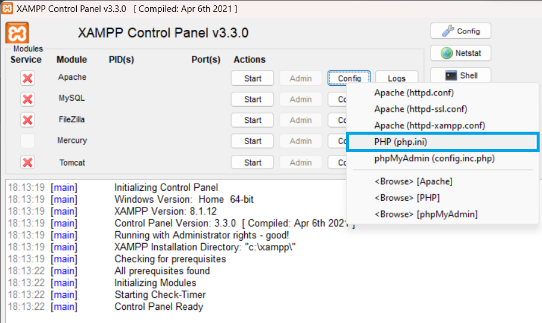

<p>Pada bagian extention, hilangkan tanda ; (titik koma) pada ekstensi yang akan diaktifkan. Kemudian
simpan kembali filenya dan restart Apache web server.</p>

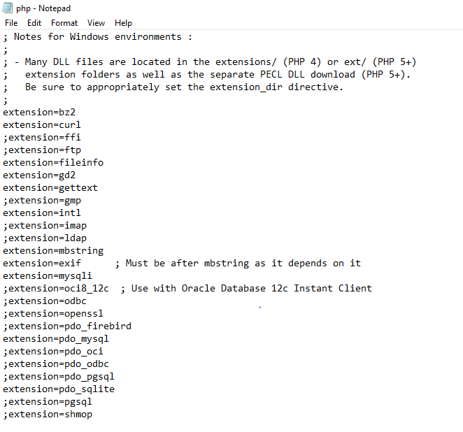

# Instalasi Codeigniter 4 (CI)

## Manual

<p>Untuk melakukan instalasi Codeigniter 4 dapat dilakukan dengan dua cara, yaitu cara manual dan
menggunakan composer. Tapi kita akan menggunakan cara manual.</p>

1. Buka situs web resmi CodeIgniter 4 di (https://codeigniter.com) dan klik tombol "Download" di menu atas. Pilih versi terbaru dari CodeIgniter 4 yang tersedia untuk diunduh.
2. Setelah selesai mengunduh, ekstrak file yang diunduh ke dalam direktori project kita (Example: htdocs/lab11_ci).
3. Ubah nama direktory framework-4.x.xx menjadi ci4.
4. Di dalam direktori ci4, ubah nama file `env` menjadi `.env` kemudian buka file tersebut dan ubah nilai variable
   CI_ENVIRONMENT menjadi development. Dan kita dapat menyesuaikan pengaturan seperti database dan konfigurasi lainnya. Pastikan untuk menyimpan file setelah melakukan perubahan.

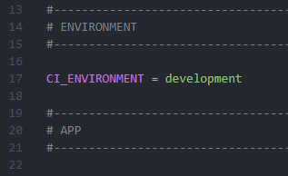

4. Kemudian, buka browser dengan alamat (http://localhost/Lab7Web/lab11_ci/ci4/public/)

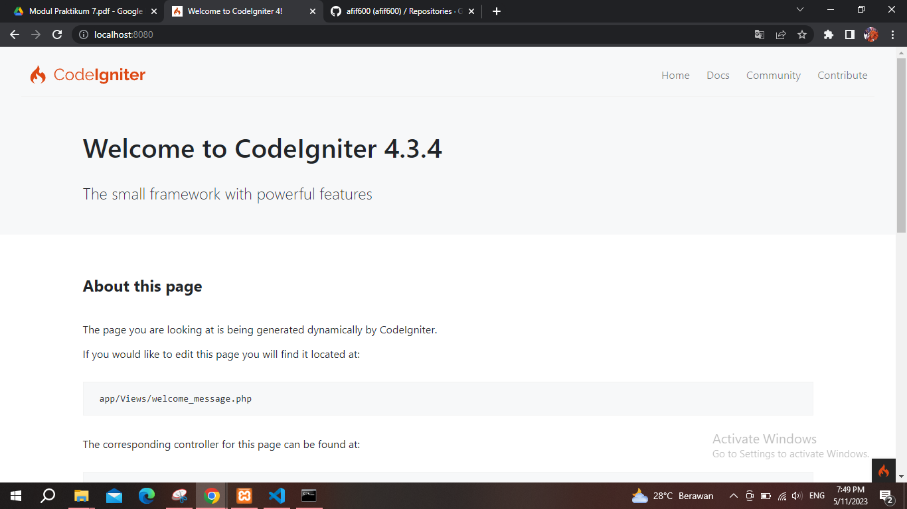

5. Setelah itu, masuk ke direktori proyek kita dan jalankan server pengembangan dengan perintah berikut:

```php
php spark serve
```


6. Buka Web browser dan buka alamat (https://localhost:8080) Jika semuanya berjalan dengan lancar, Maka tampilannya akan sama dengan gambar sebelumnya.

# Routing & Controller

<p>Pada CodeIgniter, routing digunakan untuk menentukan controller mana yang akan menangani request. Controller sendiri adalah sebuah kelas atau script yang bertanggung jawab untuk merespon request tersebut. Dalam CodeIgniter, request yang diterima oleh file index.php akan diteruskan ke Router dan kemudian diarahkan ke Controller yang sesuai.</p>
<p>Router terletak pada file app/config/Routes.php</p>

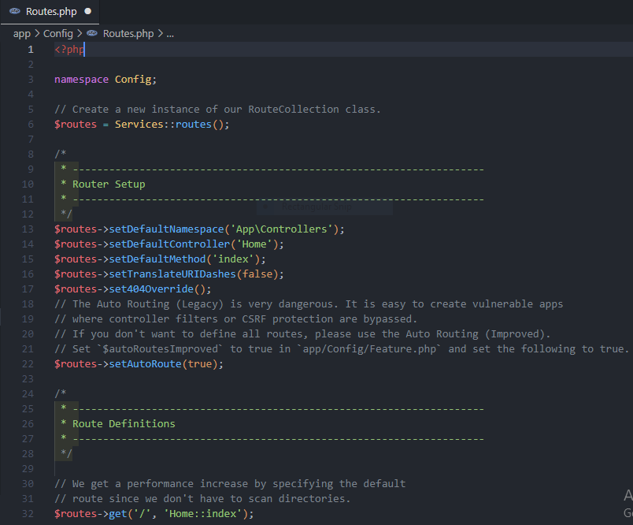

### Membuat Routes Baru

- Tambahkan kode berikut ke dalam `Routes.php`

```php
$routes->get('/about', 'Page::about');
$routes->get('/contact', 'Page::contact');
$routes->get('/faqs', 'Page::faqs');
```

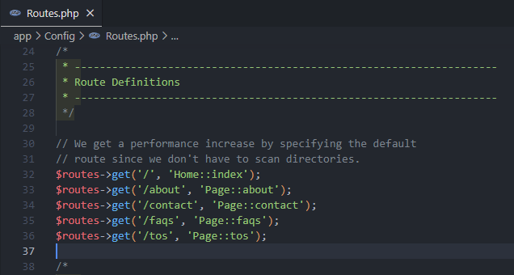

- Untuk mengetahui route yang ditambahkan sudah benar, buka CLI dan jalankan perintah berikut.

```php
php spark routes
```

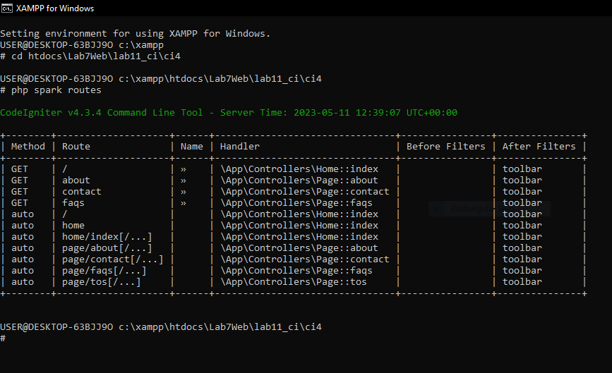

- Selanjutnya coba akses route yang telah dibuat dengan mengakses alamat (http://localhost:8080/about)


<p>Ketika diakses akan mucul tampilan error 404 file not found, itu artinya file/page tersebut tidak ada.
Untuk dapat mengakses halaman tersebut, harus dibuat terlebih dahulu Contoller yang sesuai dengan
routing yang dibuat yaitu Contoller Page.</p>

### Membuat Controller Page

- Selanjutnya adalah membuat Controller Page. Buat file baru dengan nama `page.php` pada direktori
  Controller kemudian isi kodenya seperti berikut.

```php
<?php
namespace App\Controllers;
class Page extends BaseController
{
  public function about()
  {
    echo "Ini halaman About";
  }
  public function contact()
  {
    echo "Ini halaman Contact";
  }
  public function faqs()
  {
    echo "Ini halaman FAQ";
  }
}
```

- Selanjutnya refresh kembali web browser, maka akan ditampilkan hasilnya yaitu halaman sudah dapat
  diakses.

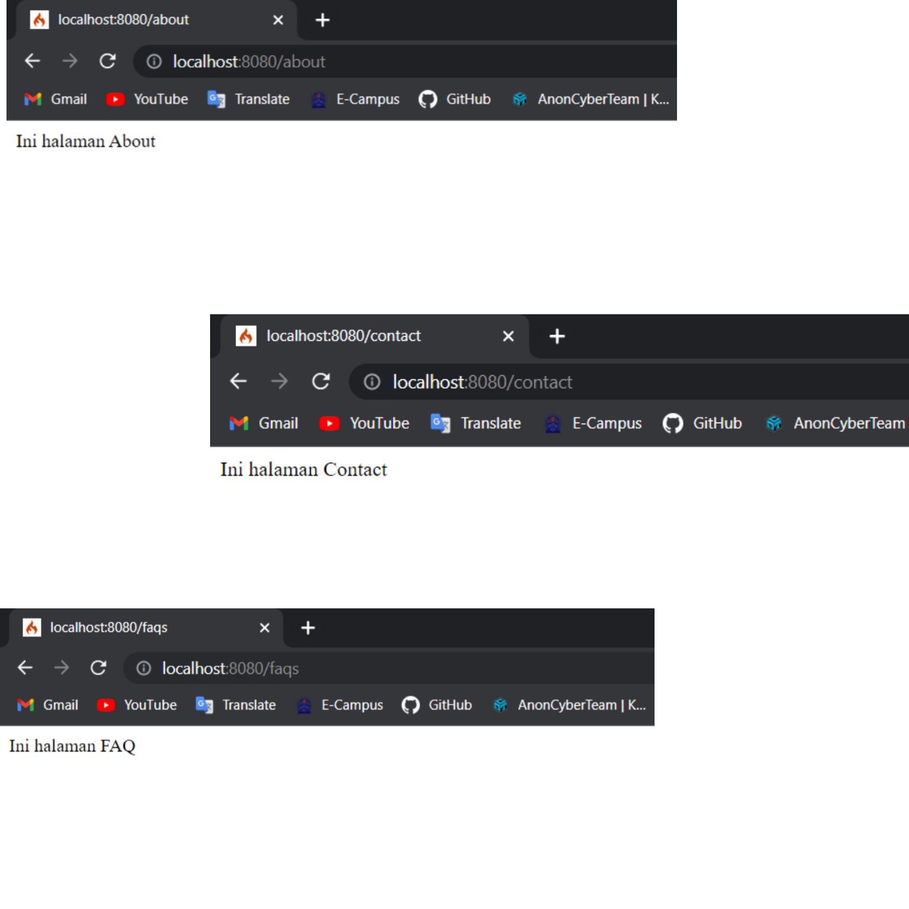

### Auto Routing

- Secara default fitur autoroute pada Codeiginiter sudah aktif. Untuk mengubah status autoroute dapat
  mengubah nilai variabelnya. Untuk menonaktifkan ubah nilai `true` menjadi `false`.

```php
$routes->setAutoRoute(true);
```

- Tambahkan method baru pada Controller Page seperti berikut.

```php
public function tos()
{
  echo "ini halaman Term of Services";
}
```

- Method ini belum ada pada routing, sehingga cara mengaksesnya dengan menggunakan alamat: (http://localhost:8080/page/tos)

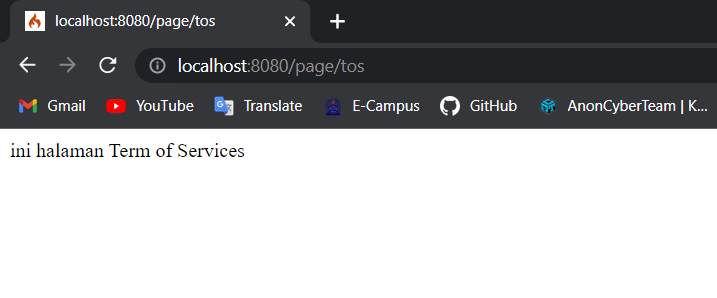

### Membuat View

- Selanjutnya dalam membuat view untuk tampilan web agar lebih menarik. Buat file baru dengan
  nama `about.php` pada direktori view (app/view/about.php) kemudian isi kodenya seperti berikut.

```php
<?= $this->include('template/header'); ?>
  <div class="content">
    <h1><?= $title; ?></h1>
    <hr>
    <p><?= $content; ?></p>
  </div>
<?= $this->include('template/footer'); ?>
```

- Ubah method about pada class Controller Page menjadi seperti berikut:

```php
public function about()
{
  return view('about', [
    'title' => 'Halaman About',
    'content' => 'Ini adalah halaman abaut yang menjelaskan tentang isi halaman ini.'
  ]);
}
```

- Kemudian lakukan refresh pada halaman web tersebut.

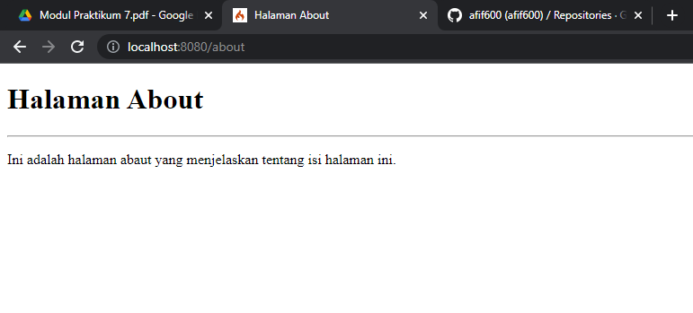

# Membuat Layout Web dengan CSS

<p>Pada dasarnya layout web dengan css dapat diimplamentasikan dengan mudah pada Codeigniter. Yang
perlu diketahui pada Codeigniter 4 adalah file yang menyimpan asset css dan javascript terletak pada
direktori public.</p>

- Buat file CSS pada direktori public dengan nama `style.css`.

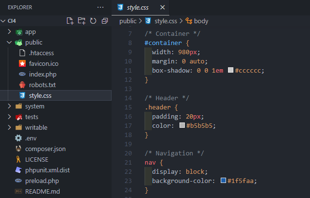

- Kemudian buat folder `template` pada direktori view. lalu buat file baru dengan nama `header.php` dan `footer.php`.

- Lalu, masukan kode berikut ke dalam file app/view/template/header.php

```php
<!DOCTYPE html>
<html lang="en">
<head>
  <meta charset="UTF-8">
  <title><?= $title; ?></title>
  <link rel="stylesheet" href="<?= base_url('/style.css'); ?>">
</head>
<body>
  <div id="container">
    <div class="header">
      <h1>Layout Sederhana</h1>
    </div>
    <nav>
      <a href="<?= base_url('/'); ?>">Home</a>
      <a href="<?= base_url('/artikel'); ?>">Artikel</a>
      <a href="<?= base_url('/about'); ?>">About</a>
      <a href="<?= base_url('/contact'); ?>">Kontak</a>
    </nav>
```

- Dan masukan juga kode berikut ke dalam file app/view/template/footer.php

```php
<section id="wrapper">
  <section id="main">
  </section>
  <aside id="sidebar">
    <div class="widget-box">
      <h3 class="title">Widget Header</h3>
      <ul>
        <li><a href="#">Widget Link</a></li>
        <li><a href="#">Widget Link</a></li>
      </ul>
    </div>
    <div class="widget-box">
      <h3 class="title">Widget Text</h3>
      <p>
        Lorem ipsum dolor sit amet consectetur adipisicing elit. Iste nemo pariatur vitae obcaecati nam in ipsa, optio nesciunt ducimus eos doloribus minus sequi, quae placeat fuga?
      </p>
    </div>
  </aside>
</section>
<footer>
  <p>&copy; 2023 - Universitas Pelita Bangsa</p>
</footer>
</div>
</body>
</html>
```

- Kemudian, ubah file app/view/about.php seperti berikut.

```php
<?= $this->include('template/header'); ?>
  <div class="content">
    <h1><?= $title; ?></h1>
    <hr>
    <p><?= $content; ?></p>
  </div>
<?= $this->include('template/footer'); ?>
```

- Tambahkan kode CSS untuk mempercantik tampilannya, dengan menambahkan kode berikut ke dalam file `style.css`.

```css
body {
  font-family: Arial, sans-serif;
  margin: 0;
  padding: 0;
}

/* Container */
#container {
  width: 980px;
  margin: 0 auto;
  box-shadow: 0 0 1em #cccccc;
}

/* Header */
.header {
  padding: 20px;
  color: #b5b5b5;
}

/* Navigation */
nav {
  display: block;
  background-color: #1f5faa;
}

nav a {
  display: inline-block;
  padding: 20px 30px;
  color: #ffffff;
  font-size: 14px;
  font-weight: bold;
  text-decoration: none;
}

nav a.active,
nav a:hover {
  background-color: #2b83ea;
}

/* Wrapper */
#wrapper {
  display: flex;
  flex-wrap: wrap;
  justify-content: flex-end;
  margin: 20px;
}

/* Main Content */
#main {
  flex-basis: 65%;
  margin-right: 10px;
}

/* Sidebar */
#sidebar {
  float: left;
  width: 100%;
  padding: 20px;
}

/* Widget */
.widget-box {
  border: 1px solid #eee;
  margin-bottom: 20px;
}

.widget-box h3.title {
  margin: 0;
  padding: 15px 16px;
  background-color: #428bca;
  color: #fff;
}

.widget-box ul {
  margin: 0;
  padding-left: 0;
  list-style: none;
}

.widget-box li {
  border-bottom: 1px solid #eee;
}

.widget-box li a {
  display: block;
  padding: 10px 16px;
  color: #333;
  text-decoration: none;
}

.widget-box li:hover a {
  background-color: #eee;
}

.widget-box p {
  padding: 0 15px;
  line-height: 25px;
}

/* Footer */
footer {
  background-color: rgb(40, 40, 40);
  color: #fff;
  padding: 5px;
  text-align: center;
}

/* Content */
.content {
  padding: 10px 20px;
  float: left;
  width: 65%;
  flex-basis: 100%;
}
```

- Selanjutnya refresh halaman web pada alamat: http://localhost:8080/about

# Pertanyaan dan Tugas

<p>Lengkapi kode program untuk menu lainnya yang ada pada Controller Page, sehingga semua link pada
navigasi header dapat menampilkan tampilan dengan layout yang sama.</p>

- Output

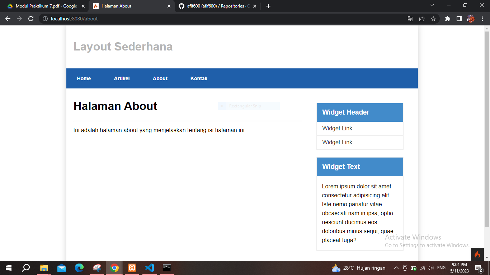

# Terima Kasih!!!
